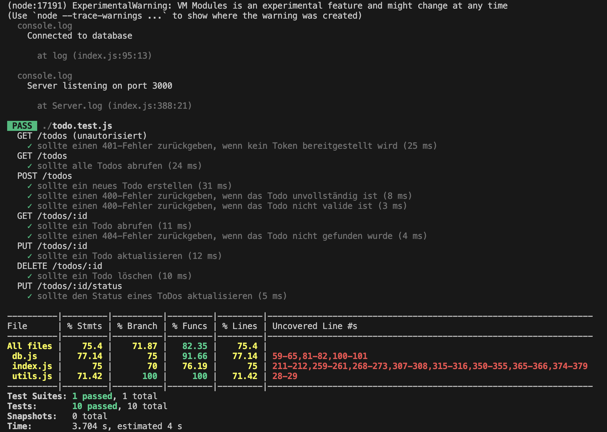
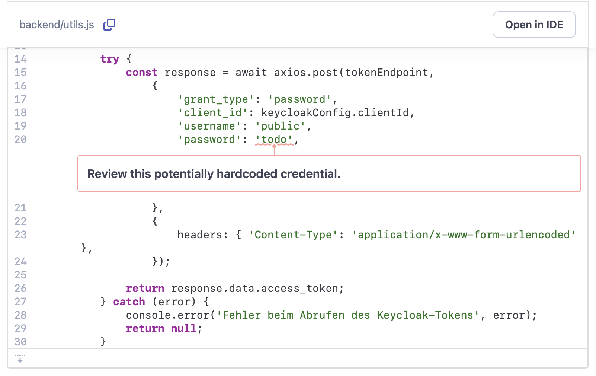

Ausarbeitung von Cihan Sözen, Matrikelnummer: 30165436

Vorgehensweise:
Zunächst wurde versucht die Endpunkte mit VS CODE und dem Termin zu testen mit Hilfe von "npm test". 
Hierbei wurde mehrere Fehler angezeigt. Bevor diese Fehler behoben wurden, wurden die Endpunkte mit Postman getestet. Alle Endpunkte funktionierten einwandfrei, solange die Eingaben vollständig und korrekt waren. Danach wurde versucht die Automatisierung mit der GitHub Action einzurichten. Dafür wurden Beispiele aus verschiedenen Quellen ausprobiert und getestet. Nachdem die Automatisierung erfolgreich eingerichtet wurde, wurden die Tests erneut durchgeführt. Allerdings wurde durch nicht bestandene Testungen auch die GitHub Action unterbrochen (build.yml). Daher mussten zunächst die Fehler behoben werden, um den Build erfolgreich durchzuführen. 

Lösung:
- Testen der Endpunkte mit Postman
- Erstellung einer GitHub Action durch die Datei "build_test.yml" (diese enthält den build und die Tests)
- Fehlerbehebung der Endpunkte
- Erneute Testund der build.yml
- Erstellung eines SonarQube Accounts und automatische Erstellung des SonarQube-Builds für die yml Datei
- Erstellung der Secrets und Vriablen in GitHub für die SonarQube-Tests (Das Repo wurde auf public gesetzt, um die Erstellung eines GITHUB-TOKEN zu umgehen :)
- Erstellung des Tests für die Aktualisierung des Status
- Erstellen des Endpunktes für die Aktualisierung des Status

Probleme und Lösungen:
- Es gab für die einzelnen Fälle (Titel fehlt, oder ist falsch etc.) kein Regelset. Entweder hätte nun in jedem Test Fallunterscheidungen eingeführt werden können, oder eine zentrale Regelung
    - Es wurden Validierungsregeln in der index.js erstellt um diese für den POST zu verwenden. 
- Die Dummy-Authentication musste ausgebaut werden, dammit überhaupt eine Autentifizierung bzw. die Antwort 'Unauthorized' möglich ist.

Ergebnisse und Tests:
Die erstellten Tests und auch die Coverage-Testung laufen durch und werden wie erwartet angezeigt im Terminal (npm test)

Die Gesamt-Coverage beträgt ca. 82% wobei die Hauptfunktionalität (index.js) eine Abdeckung von 76% hat. Die uncovered Lines gehören zu den Funktionen und sind nicht unbedingt repräsentativ für die Funktionalität.

SonatQube:
Die SonarQube-Tests wurden erfolgreich durchgeführt und die Ergebnisse sind im SonarQube Dashboard zu sehen.
Es wurde ein Security Hotspot gefunden, der allerdings nicht relevant ist, da es sich um eine Dummy-Authentifizierung handelt.

Anmerkung: 
- Gihub Action Build_test.yml wurde erstellt und getestet aber funktioniert nicht immer. Obwohl keine Änderungen vorgenommen wurden, wird der Build manchmal nicht durchgeführt.

- Erster Fork hat nicht funktioniert. Neuer Fork musste erstellt und Projekt einmal kopiert werden. 